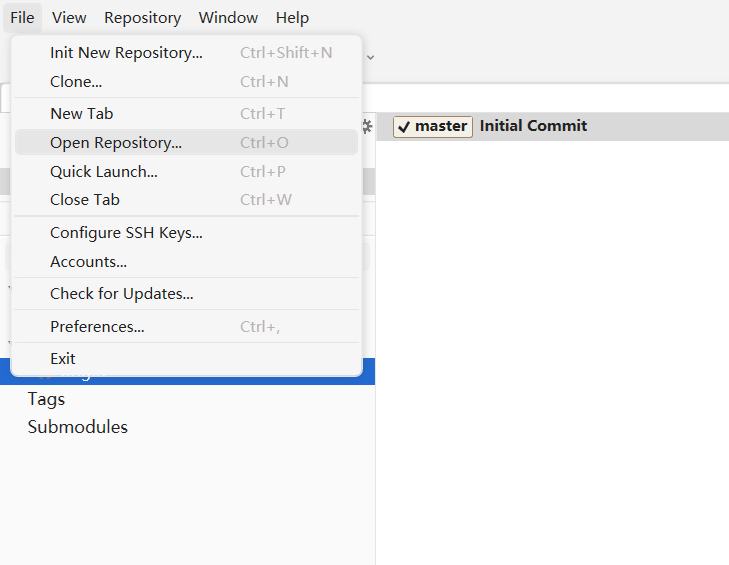

# CS4487-Project

## Part I: Greeting

(In Chinese)

Hello，队友们，这里就是我们组的秘密基地。之后的一个月我们的项目就从这里读取。

Posted on 02/11/2022

## Part II: Preparations

为了更好的沟通项目，鉴于各位有可能不会熟练地使用git命令，我们采用非常方便的Fork进行项目的同步。

下载地址：https://git-fork.com/

使用方式：

1. 首先右上角绿色Code按钮 > zip下载本项目到你的电脑上某个位置（比如桌面），解压；

2. 下载安装好Fork后打开File > Open Repository， 如图所示；

   

3. 选择刚刚下载的项目文件夹根目录，点击“选择文件夹”；

4. 之后可以使用fetch/push/pull命令更新项目；

   讲解：

   1. fetch用于获取远程（remote）端的最新情况，即其他队友最新更新的情况；
   2. pull用于将远程更新覆盖掉你本地的文件（请确定你的本地文件已妥善保存或已经push了！！）；
   3. push用于将你自己修改后的文件同步于整个项目，但是注意，如果你的上传与其他人的上传冲突，可能表示你没有基于最新的代码进行修改。所以上传前请保证你使用的是最新的代码，并在pull后与你的修改兼容。

5. 至于具体怎么修改项目，你可以用Pycharm，也可以用VS Code，哪个顺手用哪个。如有问题，随时群里联系；
6. 项目环境安装`conda env create -f environment.yaml`

## Part III: Kind Note From CS4487 TA (in a more friendly version)

Dear CS4487er,

Please be informed that:

1. The test codes of the course project should be submitted as an ipynb file (Do not include other unnecessary codes and files) and MUST be easy for TAs to run. Here we provide a template for reference：

```
def test(model, data_path):
      Accuracy, Recall, Precision, AUC = 0, 0, 0
      """
      You need to finish this function.
      """
      return Accuracy, Recall, Precision, AUC
```

2. The data to be released this late week should be split in your way and placed in the following structure before you start your course project. Correspondingly, the dataset loader in your submitted test code should be written in consistency with this data structure.

```
|--- data
	|--- train
		|---0001.png
		|---...
	|--- val
		|---...
	|--- test
		|---...
```

3. Since test sets will NOT be released to the students, each group has THREE chances before the due date (Dec. 4, 2022, 11:59 pm) to get access to the test sets for ranking.

4. Some useful resources to get started can be found at 

   https://github.com/HongguLiu/Deepfake-Detection [只有这个有用]

   https://pytorch.org/tutorials/beginner/basics/data_tutorial.html

   https://learn.microsoft.com/en-us/windows/ai/windows-ml/tutorials/pytorch-train-model
   
   https://www.kaggle.com/code/basu369victor/pytorch-tutorial-the-classification/notebook.

5. Pretrained models are allowed as long as they are not pre-trained on the exact task of DeepFake detection. In other words, you cannot use other DeepFake datasets to train or finetune your models.

6. Please send your test codes to any of the following emails: * and *.

Should you have any questions, feel free to contact our TA team.

Regards,

CS4487 TA Team

## Part IV: Project Requirements

参见文件夹`docs`中的那个课件（单独拎出来了）